# Persian Image Captioning — Expanding Flickr30k

Automatic image captioning in **Persian (Farsi)**. This project introduces a new Persian caption dataset built on top of [Flickr30k](https://bryanplummer.com/Flickr30kEntities/), and trains a Transformer-based model that looks at an image and writes a description in Persian.

---

## What does it do?

Give the model a photo → it writes a Persian sentence describing what it sees, and shows **which part of the image it was looking at** for each word.

| Input image | Generated caption (Persian) | English translation |
|---|---|---|
| Elephant on a field | یک سگ سیاه در حال دویدن است | *"A black dog is running"* — misidentified, but grammatically correct |
| City street scene | یک کارگر ساختمانی در خیابان قدم می زنند | *"A construction worker walking on the street"* |
| Waterfall / forest | یک مرد در حال تماشای یک منطقه جنگلی هستند | *"A man watching a jungle area"* |
| Kitchen with food | مردی با لباس سبز در حال خوردن غذا است | *"A man in a green shirt eating food"* |

---

## How it works

```
Photo
  │
  ▼
MobileNetV3Small                  ← pretrained on ImageNet, frozen
(feature extractor)
  │
  ▼
7 × 7 grid of feature vectors     ← 49 spatial regions, each 576-dim
  │
  ├──────────────────────────────────────────────────────────┐
  │                                                          │
  ▼                                                          ▼
[START]                                              Image features
  │                                                    (cross-attention)
  ▼
Token + Positional Embedding
  │
  ▼
Decoder Layer × 2
  ├── Causal Self-Attention        ← each word attends to previous words
  ├── Cross-Attention              ← each word attends to image regions
  └── Feed-Forward
  │
  ▼
Vocabulary logits (10,000 words)
  │
  ▼
Next Persian word  →  append  →  repeat until [END]
```

The **cross-attention** step is what makes the attention maps possible: for every word the model generates, you can see which of the 49 image regions it was focusing on.

---

## The Dataset

### Overview

| Property | Value |
|---|---|
| Source images | Flickr30k (10,200 images) |
| Captions per image | 5 |
| Total captions | **51,000** |
| Language | Persian (Farsi) |
| Average caption length | 12.3 words |
| Caption length range | 2 – 77 words |
| Vocabulary size (model) | 10,000 words |

This is the **first Persian image captioning dataset** based on Flickr30k. Each image also retains its original English captions, making this a bilingual resource.

### CSV structure

| Column | Description |
|---|---|
| `image_name` | Flickr30k image filename (e.g. `207344485.jpg`) |
| `comment_number` | Caption index per image (0–4) |
| `comment-fa` | **Persian caption** (the main contribution) |
| `comment-en` | English caption from the original Flickr30k dataset |

### Caption length distribution

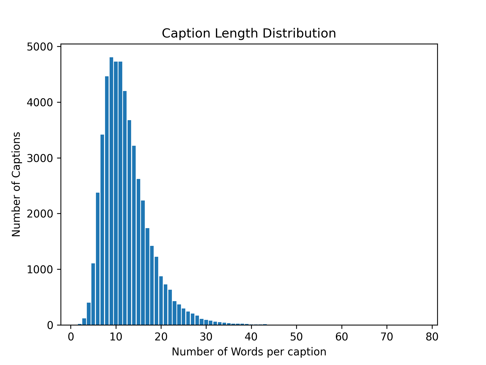

Most captions are 8–14 words. The longest caption (77 words) describes a BMX stunt in exhaustive detail; the shortest are just two words like *"خمیازه سگ"* ("dog's yawn").

### Extreme caption examples

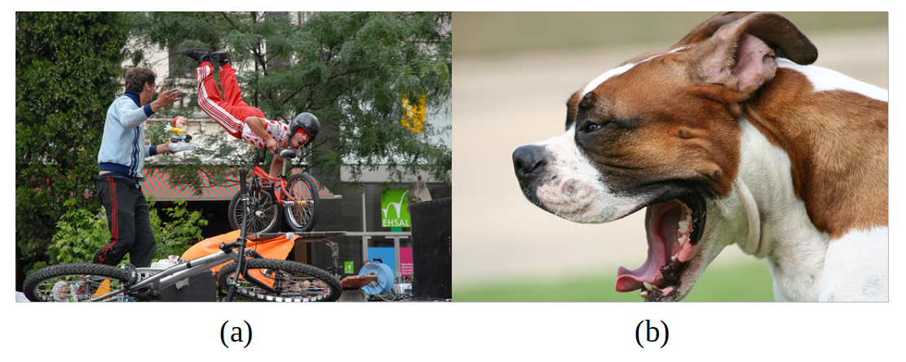

*(a) Longest caption — 77 words (b) Shortest caption — 2 words*

### Most frequent words

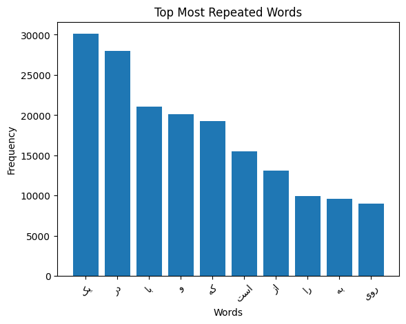

Common words like *یک* (a/an), *در* (in), *با* (with) appear tens of thousands of times — consistent with the grammar of descriptive Persian sentences.

### Get the dataset

The dataset is not included in this repository due to size. Download it from Kaggle:

- **Images**: [Flickr30k on Kaggle](https://www.kaggle.com/datasets/hsankesara/flickr-image-dataset/versions/1)
- **Persian captions CSV**: [Image Captioning Dataset on Kaggle](https://www.kaggle.com/code/hsankesara/image-captioning)

Place files as follows:
```
dataset/
├── captions.csv           ← image_name + comment_number + comment-fa + comment-en
├── train_captions.csv     ← list of training image filenames
└── test_captions.csv      ← list of test image filenames

dataset/images/            ← all Flickr30k .jpg files go here
```

---

## Model Architecture

The model has three parts:

### 1. Image Encoder (frozen)
**MobileNetV3Small** pretrained on ImageNet. The final classification layer is removed; the last feature map (`7×7×576`) is used instead. Each image becomes a sequence of 49 spatial feature vectors fed into the decoder.

### 2. Transformer Decoder (trained)
A 2-layer decoder stack. Each layer contains:
- **Causal Self-Attention** — the model can only look at words generated so far, not future words
- **Cross-Attention** — each output token attends to all 49 image regions
- **Feed-Forward** — pointwise transformation

The cross-attention weights are saved after inference to produce the attention visualizations.

### 3. Output Layer
A dense layer over the 10,000-word vocabulary with smart initialization: the initial bias is set to `log(word_frequency)`, which gives the model a better starting point than uniform initialization and reduces the initial loss significantly.

---

## Training

| Setting | Value |
|---|---|
| Optimizer | Adam, lr = 1e-4 |
| Loss | Masked sparse softmax cross-entropy |
| Accuracy | Token-level masked accuracy |
| Batch size | 32 |
| Steps per epoch | 100 |
| Epochs | up to 300 (early stopping, patience=5) |
| Decoding temperature | 0.0 (greedy) / 0.5 / 1.0 (random) |

### Training curves

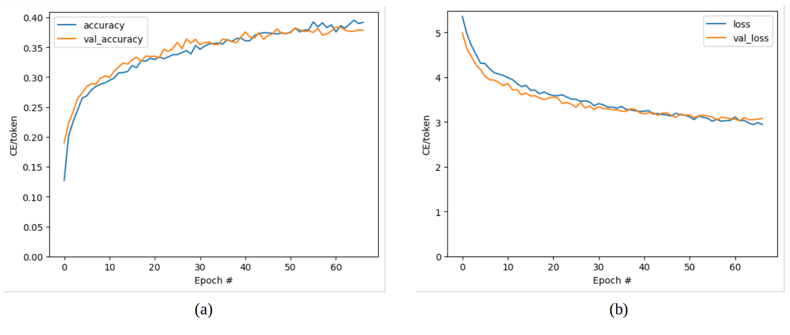

The model converges to roughly **38% token accuracy**. The primary goal of this work is the dataset itself rather than pushing accuracy — no additional techniques (beam search, BLEU optimization, data augmentation) were applied.

---

## Results — Attention Maps

Each output image shows the generated Persian caption at the top, then one panel per word showing where the model was looking in the image (lighter = more attention).

**Waterfall scene**

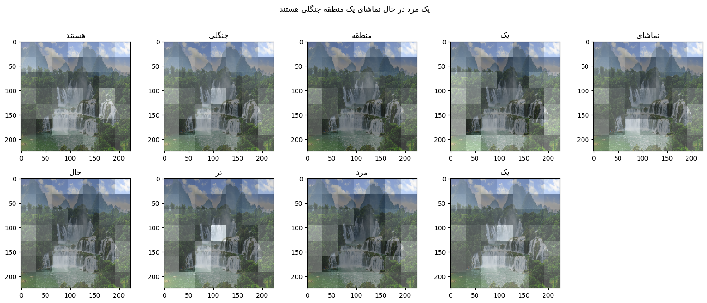

*"یک مرد در حال تماشای یک منطقه جنگلی هستند"* — "A man watching a jungle area"

---

**Forest / outdoor scene**

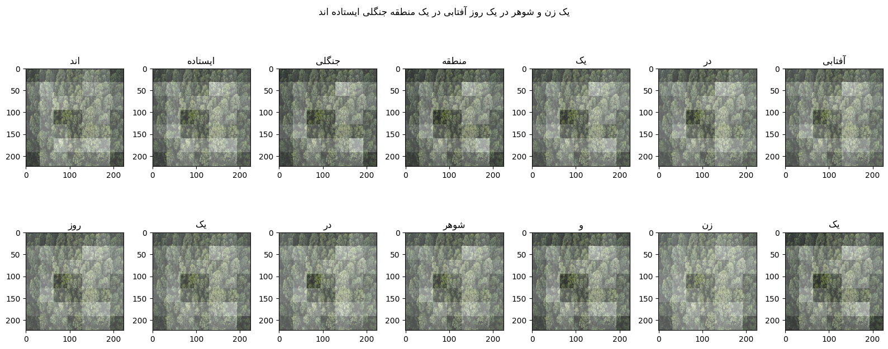

*"یک زن و شوهر در یک روز آفتابی در یک منطقه جنگلی ایستاده اند"* — "A husband and wife standing on a sunny day in a jungle"

---

**Elephant (misidentified)**

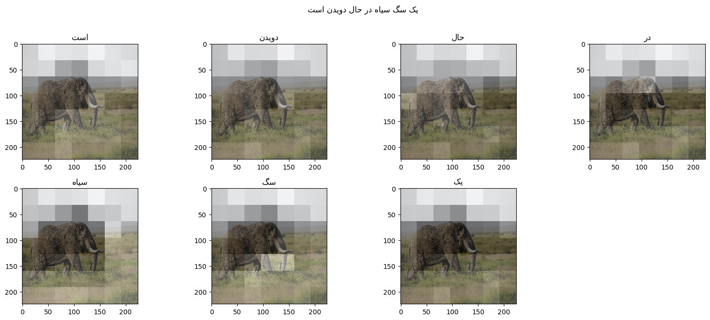

*"یک سگ سیاه در حال دویدن است"* — "A black dog is running"

The model misidentifies the elephant as a dog — the training set contains far more dogs than elephants. Despite the wrong label, the grammar is perfectly correct and the attention maps show the model correctly focuses on the animal's body.

---

**Camera (misidentified)**

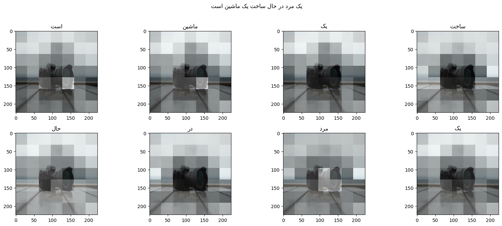

*"یک مرد در حال ساخت یک ماشین است"* — "A man is building a machine"

Scene bias: the camera is on a surface that looks like a workbench, so the model interprets it as a construction scene.

---

**City street**

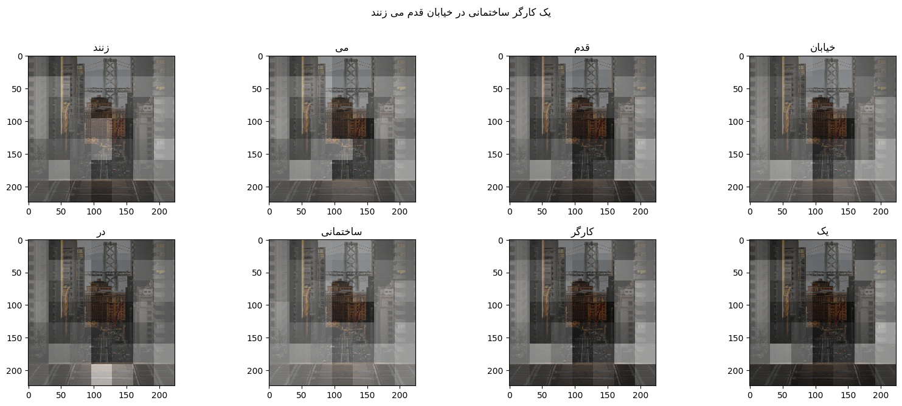

*"یک کارگر ساختمانی در خیابان قدم می زنند"* — "A construction worker walking on the street"

---

**Kitchen / food**

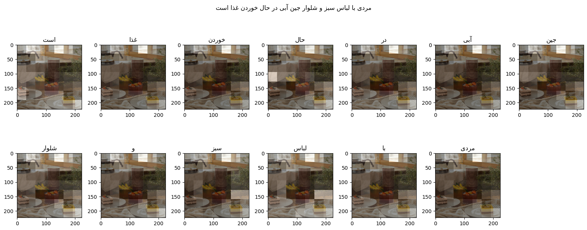

*"مردی با لباس سبز و شلوار جین آبی در حال خوردن غذا است"* — "A man in a green shirt and blue jeans is eating food"

---

**Rainy city**

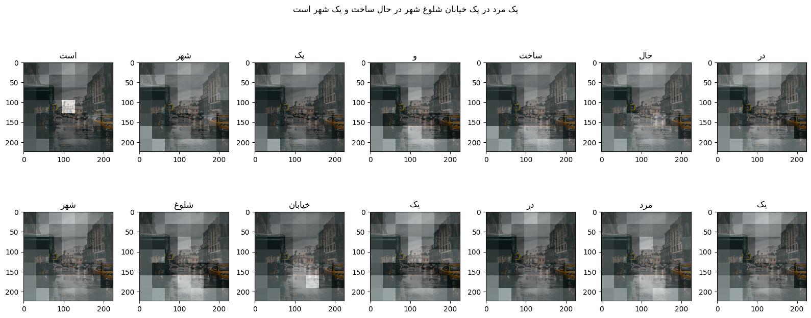

*"یک مرد در یک خیابان شلوغ شهر در حال ساخت و یک شهر است"* — "A man in a busy city street building a city"

---

## Setup & Usage

### Requirements

```bash
pip install tensorflow tensorflow_text tensorflow_datasets tensorflow_hub
pip install einops matplotlib numpy pandas Pillow tqdm arabic-reshaper python-bidi
```

### Run training

Open `src/train.ipynb` in Jupyter and run all cells. The notebook:

1. Loads captions and image paths from `dataset/`
2. Builds a MobileNetV3Small feature extractor
3. Builds a 10,000-word Persian tokenizer
4. Optionally caches image features to disk (speeds up training)
5. Trains the Transformer decoder
6. Generates attention map visualizations on test images

### Caption your own image

In the last cell of the notebook, set `image_path` to your image file:

```python
image_path = '/path/to/your/image.jpg'
image = load_image(image_path)
run_and_show_attention(model, image)
```

This prints the Persian caption and displays attention maps for each word.

### Temperature parameter

The model supports three decoding modes:

| Temperature | Behaviour |
|---|---|
| `0.0` | Greedy — always picks the most likely next word |
| `0.5` | Balanced — mix of likely and varied |
| `1.0` | Random — samples from the full distribution |

---

## Project Structure

```
image_captioning/
├── src/
│   ├── train.ipynb          ← main notebook: data loading, training, inference
│   ├── analyze_captions.py  ← dataset statistics and plots
│   ├── process_csv.py       ← CSV preprocessing utilities
│   └── results/             ← attention map outputs (PNG)
├── dataset/                 ← CSV files (not in repo — download separately)
├── text/
│   ├── main.tex             ← research paper (LaTeX source)
│   ├── loss.png             ← training curves
│   ├── length_distribution.png
│   ├── top_repeated.png
│   └── long_short.jpg
└── README.md
```

---

## Paper

This project accompanies the paper:

> **Expanding Flicker30k: a Novel Dataset for Image Captioning in Persian**
> Shima Baniadamdizaj

The LaTeX source is in `text/main.tex`. To build the PDF:
```bash
cd text && ./build.sh
```

---

## References

- [Flickr30k dataset](https://bryanplummer.com/Flickr30kEntities/)
- [TensorFlow image captioning tutorial](https://www.tensorflow.org/text/tutorials/image_captioning)
- [MobileNetV3](https://keras.io/api/applications/mobilenet/)
- [Attention is All You Need](https://arxiv.org/abs/1706.03762)
